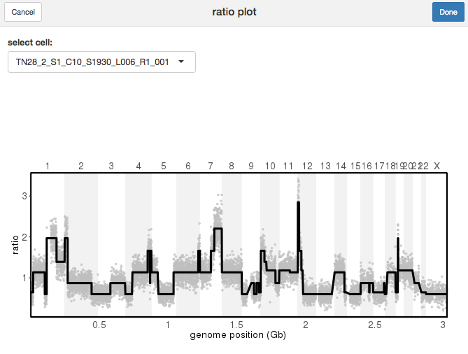
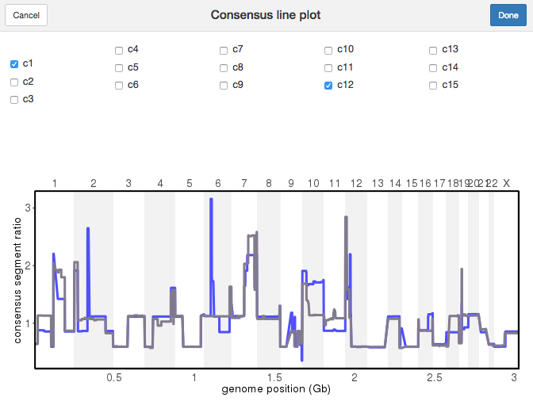

---
output:
  pdf_document: default
  html_document: default
---
# Analysis and Visualization module

The analysis and visualization module from CopyKit work in synergy to help you analyze and assess the results.

## plotMetrics()

`plotMetrics()` can plot any information available within `colData()`. 
```{r coldata_names}
names(colData(tumor))
```

colData information is provided to the argument `metric`.

The argument label, if supplied, will color the points based on that information.
```{r}
plotMetrics(tumor, metric = c("overdispersion", 
                              "breakpoint_count",
                              "reads_total",
                              "reads_duplicates",
                              "reads_assigned_bins",
                              "percentage_duplicates"),
            label = "percentage_duplicates")
```

## plotRatio()

It is important to visualize that the segmentation behaved as expected and closely follows the ratios.  

Ratio plots are a great tool for this. `plotRatio()` has two different modes.

When the input is the CopyKit object, an interactive app will open, allowing selection of which cell will be visualized.
```{r plot_ratio_app, eval = FALSE}
plotRatio(tumor)
```
<center>

</center>

If a sample name is provided to `plotRatio()`, only the plot for that cell will be shown.

```{r plot_ratio_sample, warning = FALSE}
plotRatio(tumor, "PMTC6LiverC117AL4L5S1_S885_L003_R1_001")
```

## runUmap()

`runUmap()` generates a [UMAP](https://umap-learn.readthedocs.io/en/latest/) embedding. The resulting embedding is stored in the `reducedDim` slot 

`runUmap()` is an important pre-processing step to the `findClusters()` feature.

```{r run_umap}
tumor <- runUmap(tumor)
```

Additional arguments to control umap parameters can be passed on to`runUmap()` with the '...' argument. 

The full list of additional arguments that can be passed on to `uwot::umap`  with the '...' argument to `runUmap()` can be seen in the [uwot manual](https://cran.r-project.org/web/packages/uwot/uwot.pdf).

## plotUmap()

`plotUmap()` can be used to visualize the reduced dimensional embedding. plotUmap can be colored by any element of the colData with the argument 'label'.

```{r}
plotUmap(tumor)
```

## Clustering

`findClusters()` uses the reduced dimensional embedding resulting from `runUmap()` to perform clustering at two levels (superclones and subclones).

At a more fine-grained resolution, CopyKit can also be used to detect subclones. To do so, the umap embedding is used as the pre-processing step.

When clustering for superclones `findClusters()` creates a graph representation of the reduced dimension embedding using a shared nearest neighbor algorithm (SNN). From this graph the connected components are extracted and generally represent high-level structures that share large copy number events.

CopyKit can also be used to detect subclones. The umap embedding used as the pre-processing step. 
Different clustering algorithms can be used to detect subclones:
1) [hdbscan](https://hdbscan.readthedocs.io/en/latest/how_hdbscan_works.html) (default)
2) [Leiden](https://www.nature.com/articles/s41598-019-41695-z)
3) [Louvain](https://arxiv.org/abs/0803.0476)

The hdbscan method is recommended and has been successfully previously applied in the work from Laks *et al.* [@RN6].

### findSugestedK()

To help with parametrization, CopyKit provides the helper `findSuggestedK()` function. findSuggestedK performs a clustering bootstrapping over a range of k values and returns the value that maximizes the jaccard similarity, by default the metric being maximized is *median* (argument `metric`). While findSuggestedK does not guarantee optimal clustering but provides a guide that maximizes cluster stability.

```{r find_suggested_k}
tumor <- findSuggestedK(tumor)
```

We can inspect the results of `findSuggestedK()` with `plotSuggestedK()`.

The default geom plots a boxplot of each k assessed during the grid search as the red point inside each boxplot
```{r plot_suggested_k_boxplot}
plotSuggestedK(tumor)
```
In which red dots represent the mean.

if the argument `geom` is set to *tile*, `plotSuggestedK()` plots a heatmap where each row is a detected subclone, each column is a k assessed during the grid search and the color represents the jaccard similarity for a given clone.

Clones not detected in a given k are presented in gray.
```{r plot_suggested_k_tile}
plotSuggestedK(tumor, geom = 'tile')
```

It is also possible to visualize the relation between subclone sizes with the jaccard similarity setting geom to *scatterplot*
```{r plot_suggested_k_scatter, fig.width = 6, fig.height=5}
plotSuggestedK(tumor, geom = 'scatterplot')
```

The suggested value is stored into the metadata and can be accessed at:
```{r find_sug_meta}
S4Vectors::metadata(tumor)$suggestedK
```

### findClusters()

To run `findClusters()` we can provide the CopyKit object.

```{r findCL_findSuggested}
tumor <- findClusters(tumor)
```

If `findSuggestedK()` was run prior, and the argument 'k_subclones' is not provided, `findClusters()` will automatically use the value resulting from `findSuggestedK()` that was stored into the metadata:

k values can be manually controlled with 'k_superclones' and 'k_subclones'.
*NOTE:* k_superclones and k_subclones can be used concurrently. Only k_subclones is a mandatory field.

```{r findCl_withparam, eval = FALSE}
tumor <- findClusters(tumor,
                      k_superclones = 30,
                      k_subclones = 15)
```

If the method used for clustering was *hdbscan*, it is possible that a subgroup of outliers is identified, those are added to subgroup `c0` and may be removed by subsetting the copykit object. Copykit will inform if any cell was classified as c0 in an informative message after running `findClusters()`

```{r filter_outliers}
tumor <- tumor[,colData(tumor)$subclones != 'c0']
```

We can use different plotting functions to visualize clustering results. For example `plotUmap()` can be used with the argument 'label':

```{r plot_umap_subclones}
plotUmap(tumor, label = 'subclones')
```

## runPhylo()

To run a phylogenetic analysis use the function `runPhylo()`. 
Available methods are [Neighbor Joining](https://pubmed.ncbi.nlm.nih.gov/3447015/) and [Balanced Minimum evolution](https://pubmed.ncbi.nlm.nih.gov/8412650/)

The resulting tree is stored within the CopyKit object in the phylo slot:
```{r run_phylo}
tumor <- runPhylo(tumor, metric = 'manhattan')
```

## plotPhylo()

To visualize the resulting phylogenetic trees from `runPhylo()` we can use the `plotPhylo()` function.

```{r plot_phylo, fig.height=8}
plotPhylo(tumor)
```

`plotPhylo()` can use any element of the colData to color the leaves of the tree.

```{r plot_phylo_label, fig.height=8}
plotPhylo(tumor, label = 'subclones')
```

## calcInteger()

Segment ratio means can be scaled to integer values with `calcInteger()`. 

CopyKit supports different methods of calculating integer copy number profiles.

To calculate computational ploidies CopyKit adopts the [scquantum]() package. To use scquantum just set the argument method to *scquantum*.

```{r calc_integer_scquantum, eval = FALSE}
tumor <- calcInteger(tumor, method = 'scquantum')
```

By setting the argument `method` to *fixed*, a fixed value of ploidy (generally determined using Flow Cytometry) will scale all cells.

```{r calc_integer_fixed}
tumor <- calcInteger(tumor, ploidy_value = 4.3)
```

Alternatively, if different ploidies are needed for different cells, a vector containing the ploidies can be passed on to `calcInteger()`, as long as it is of the same length and sample order as `colData()`

The integer values are stored in the slot `integer` that can be accessed with the function `assay()`

If the assay _integer_ exists, `plotRatio()` will use it to plot the integer copy number values as a secondary axis.
```{r plot_ratio_integer, warning=FALSE}
plotRatio(tumor, "PMTC6LiverC117AL4L5S1_S885_L003_R1_001")
```

## plotHeatmap()

To visualize copy number profiles with a heatmap we can use `plotHeatmap()` 

The heatmap can be annotated with elements of colData.

To order subclones, one option is to calculate a consensus phylogeny, explained in later sections:
```{r}
tumor <- calcConsensus(tumor)
tumor <- runConsensusPhylo(tumor)
```

To plot the heatmap.
```{r plot_heatmap_subclones, fig.height=8}
plotHeatmap(tumor, label = 'subclones')
```

To plot integer copy number heatmaps pass the argument `assay = 'integer'`, importantly the integer matrix must be in the `'integer'`slot.
```{r plot_ht_int, fig.height=8}
plotHeatmap(tumor, assay = 'integer')
```

New information can be added to `colData()` and used in conjunction with the plotting functions. 

The example dataset has macro-spatial information. 
The information is encoded in the sample name by the letter S followed by a number. We can extract that information and add it as an extra column to the metadata:

```{r add_spatial_info}
colData(tumor)$spatial_info <- stringr::str_extract(colData(tumor)$sample, "L[0-9]")
```

Once the information has been added, we can use it to color the umap by their spatial information:

```{r umap_spatial}
plotUmap(tumor, label = 'spatial_info')
```

It is also possible to annotate the heatmap with that information:
The 'label' argument for `plotHeatmap()` can add as many annotations as specified by the user as long as they are elements in `colData()` of the CopyKit object.
```{r heat_spatial, fig.height=8}
plotHeatmap(tumor, label = c("spatial_info", "subclones"))
```

If `calcInteger()` was performed, it is possible to visualize deviations from the expected integer states by using `plotHeatmap()` with the argument `rounding_error` set to `TRUE`

```{r rounding_error, fig.height=8}
plotHeatmap(tumor, label = 'subclones', assay = 'integer', rounding_error = TRUE)
```

## plotFreq()

Computing the frequencies of genomic gain or losses across the genome can be useful to visualize differences between groups. This can be done with `plotFreq()`. 
For every region of the genome, `plotFreq()` will calculate the frequency of gain or losses according to a threshold across all samples.
The thresholds are controlled with the arguments `low_threshold` (values below will be counted as genomic losses) and `high_threshold` (values above will be counted as genomic gains).

Ideally thresholds will be set according to the ploidy of the sample. 
For example, the sample presented throughout this documentation has a ploidy of approximately 4.3, therefore a gain or loss of one copy number for this sample should have a difference in the segment ratio value of 1/4.3 (~0.23). Therefore we will set the accordingly to a difference of plus or minus 0.2 (leaving some room for error), compared to a segment ratio of 1.

The argument `assay` can be provided to pass on the `integer` assay instead of the `segment_ratios` assay (adjust thresholds accordingly).

Two geoms are available `area` or `line`
```{r plot_freq_sample}
plotFreq(tumor, low_threshold = 0.8, high_threshold = 1.2)
```

Group information can be set to any categorical element of the `colData()` and is provided with the argument `label`.

```{r plot_freq_label, fig.height=6}
plotFreq(tumor, 
         low_threshold = 0.8, 
         high_threshold = 1.2, 
         label = 'spatial_info')
```

## calcConsensus()

Consensus sequences can help visualize the different segments across subclones. To calculate consensus matrices we can use `calcConsensus()`
```{r calc_consensus}
tumor <- calcConsensus(tumor)
```

`plotHeatmap()` can plot a consensus heatmap:
```{r plot_heat_consensus}
plotHeatmap(tumor, consensus = TRUE, label = 'subclones')
```

`plotHeatmap()` can annotate the consensus heatmap with information from the metadata:
```{r plot_heat_freq_bar}
plotHeatmap(tumor, consensus = TRUE, label = 'subclones', group = 'spatial_info')
```

By default `calcConsensus()` uses the subclones information to calculate a consensus for each subclone.
Any element of the `colData()` can be used to calculate the consensus.

**Note:** Consensus matrices can be calculated from the integer assay. Importantly, the integer matrix must be in the `assay(tumor, 'integer')` slot. Check `calcInteger()` for more info.
```{r eval = FALSE}
tumor <- calcConsensus(tumor, consensus_by = 'subclones', assay = 'integer')
```

## plotConsensusLine()

To compare the differences among subclones, `plotConsensusLine()` opens an interactive app where the consensus sequences are plotted as lines.

```{r calc_consensus_again, echo = FALSE}
tumor <- calcConsensus(tumor)
```

```{r plot_cons_line, eval=FALSE}
plotConsensusLine(tumor)
```

<center>

</center>

## findVariableGenes()

Finding variable genes can provide important information as to which genes contribute the most to the subclonal structure of the sample. This can be done with `findVariableGenes()`.

`findVariableGenes()` requires a list of genes with the argument `genes`. 

A list of 100 putative oncogenes and tumor supressor genes from [Davoli et al.](https://www.sciencedirect.com/science/article/pii/S0092867413012877?via%3Dihub) can be found in a vector called `tumor_genes`, which is loaded with CopyKit.
The argument `top_n` controls the number of genes to be returned

```{r fvg}
tumor <- findVariableGenes(tumor, 
                           genes = tumor_genes,
                           top_n = 30)
```

The resulting list of variable genes is stored within the metadata of the CopyKit object.
```{r fvg_result}
metadata(tumor)$hvg
```
Results are presented from most variable to list variable. 

The results can be visualized with `plotVariableGenes()` and `plotGeneCopy()`.

Note: Genes with large diversity of copy number states tend to be oncogenes, Using `findVariableGenes()` as a discovery tool can under represent events in tumor supressor genes that tend to be deleted. 

Genes can be annotated to a heatmap in `plotHeatmap()` with the _genes_ argument.
```{r plot_heatmap_subclones_genes, fig.height=8}
plotHeatmap(tumor, label = 'subclones', genes = metadata(tumor)$hvg)
```

The genes argument can be a vector of gene HUGO symbols:
```{r plot_heatmap_subclones_genes_falsee, eval=FALSE, fig.height=8}
plotHeatmap(tumor, label = 'subclones', genes = c("TP53", "BRAF", "MYC"))
```

## plotVariableGenes()

`plotVariableGenes()` is a visualization for the results from `findVariableGenes()`.

```{r pvg, fig.height=6}
plotVariableGenes(tumor)
```

## plotGeneCopy()

To check copy number states across of genes we can use `plotGeneCopy()`. Two different geoms: “swarm” (default) or “violin” can be applied. 

As with other plotting functions, points can be colored with the argument 'label'.

```{r}
plotGeneCopy(tumor, genes = c("CDKN2A",
                              "FGFR1",
                              "TP53",
                              "PTEN",
                              "MYC",
                              "CDKN1A",
                              "MDM2",
                              "AURKA",
                              "PIK3CA",
                              "CCND1",
                              "KRAS"),
                      label = 'spatial_info')
```

`plotGeneCopy()` can be specially useful to visualize the result from `findVariableGenes()`

```{r pgc_fvg}
plotGeneCopy(tumor,
             genes = metadata(tumor)$hvg,
             label = 'spatial_info')
```

A barplot geom is also provided to visualize the integer data as a frequency barplot for each gene:
```{r plot_gene_copy_integer}
plotGeneCopy(tumor, genes = c("CDKN2A",
                              "FGFR1",
                              "TP53",
                              "PTEN",
                              "MYC",
                              "CDKN1A",
                              "MDM2",
                              "AURKA",
                              "PIK3CA",
                              "CCND1",
                              "KRAS"),
             geom = 'barplot',
             assay = 'integer')
```

## plotAlluvial()

To visualize frequencies across elements of the metadata we can use `plotAlluvial()` 
```{r}
plotAlluvial(tumor, label = c("subclones", "spatial_info"))
```

