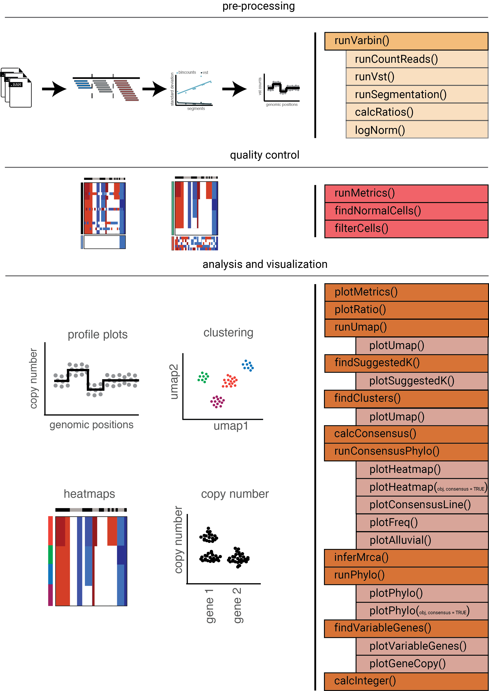

--- 
title: "CopyKit User Guide"
author: "Darlan Conterno Minussi"
date: "Last revised: `r Sys.Date()`"
site: bookdown::bookdown_site
documentclass: book
bibliography: [book.bib, packages.bib]
biblio-style: apalike
link-citations: no
description: "This is a user guide for the package CopyKit: A toolkit for single-cell CNA analysis."
---

# Introduction

<center>
{height=30% width=30%}
</center>


The goal of CopyKit is to help you analyze single cell DNA sequencing datasets for copy number. For that, CopyKit presents four modules:

    - Pre-processing
    - Quality Control
    - Data Analysis
    - Visualization

The following chapters will cover each module in detail.

<center>
{height=60% width=60%}
</center>

Generated with *CopyKit* version:
```{r version}
packageVersion("copykit")
```


